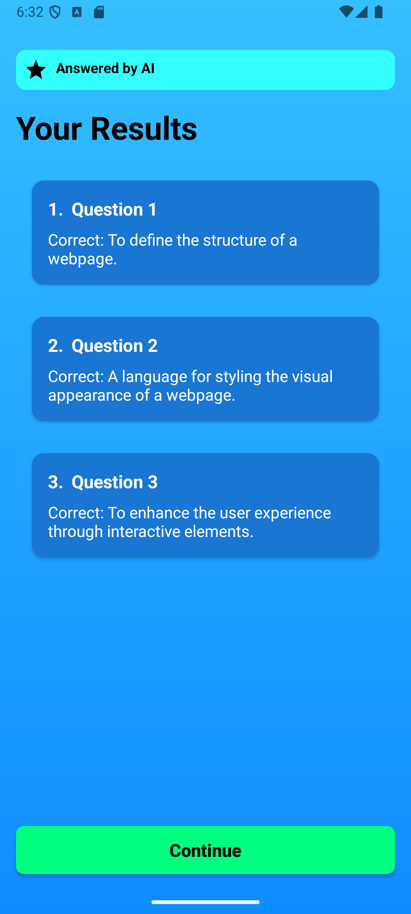
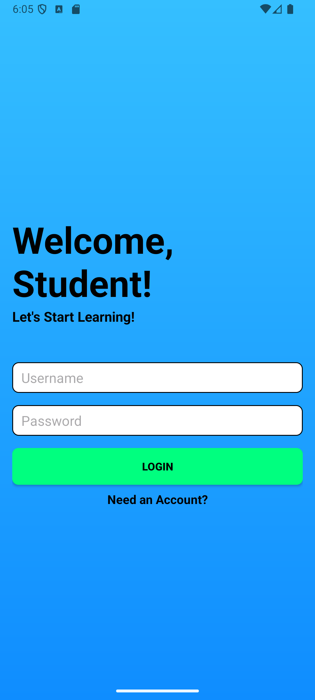
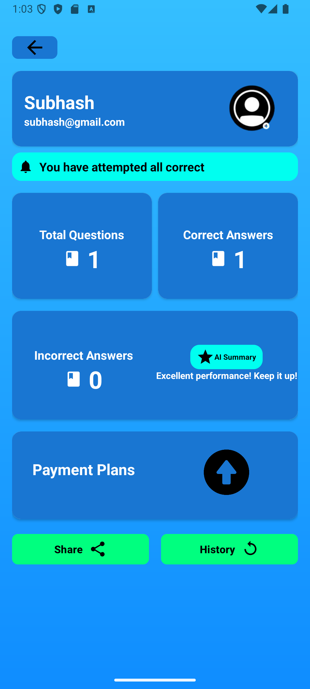

# Personalized Learning App 📚🧠

<div align="center">
  
  
  
</div>

An intelligent Android application that delivers customized quizzes based on user interests and learning performance, powered by AI and featuring comprehensive analytics, social sharing, and premium subscription plans.

## ✨ Core Features

### 🎯 **AI-Powered Learning System**
- **Smart Quiz Generation** - AI-generated quizzes using advanced language models
- **Adaptive Topic Selection** - Algorithm selects topics needing improvement
- **Performance-Based Learning** - Dynamic difficulty adjustment based on user performance
- **AI Summary Insights** - Personalized motivational feedback and learning recommendations

### 📊 **Comprehensive Analytics & Tracking**
- **Real-Time Statistics** - Total questions, correct answers, accuracy percentages
- **Performance History** - Detailed historical data with visual indicators
- **Topic-Specific Tracking** - Individual subject performance with attempt counters
- **Progress Notifications** - Smart notifications about learning achievements

### 💎 **Premium Subscription Plans**
- **Starter Plan** ($9.99/month) - Essential quiz generation
- **Intermediate Plan** ($19.99/month) - Advanced quiz generation + detailed analytics
- **Advanced Plan** ($29.99/month) - Premium features + AI insights + 24/7 support
- **Stripe Integration** - Secure payment processing with multiple payment methods

### 🌐 **Social Features & Sharing**
- **Multi-Platform Sharing** - WhatsApp, Facebook, Twitter, Instagram, Telegram integration
- **Profile Sharing** - Share learning progress and achievements
- **Social Media Integration** - Direct sharing to popular platforms
- **Performance Broadcasting** - Showcase learning milestones

### 📱 **User Experience Excellence**
- **Material Design UI** - Modern, intuitive interface with smooth animations
- **Interactive Quiz Interface** - Expandable questions with progress tracking
- **Comprehensive Results Display** - Detailed post-quiz analysis
- **Performance History Page** - Visual performance indicators with color coding
- **User Profile Management** - Complete profile system with statistics

### 🔐 **Authentication & User Management**
- **Secure Registration** - Complete user onboarding with validation
- **Interest Selection** - 21+ topic categories with visual feedback
- **Profile Customization** - Personalized learning preferences
- **Data Persistence** - Secure local storage with cloud sync capability

## 📸 Screenshots

| Login | Registration | Interests |
|-------|--------------|-----------|
|  |  |  |

| Home | Quiz | Results |
|------|------|---------|
|  |  |  |

| Profile | History | Upgrade Plans |
|---------|---------|---------------|
|  |  |  |

| Share Profile | Checkout Payment |
|---------|---------|
|  |  |

## 🛠️ Technical Architecture

### **Backend Infrastructure**
- **AI Model**: Google Gemma 3-1B-IT for intelligent content generation
- **Flask API**: RESTful backend with comprehensive endpoints
- **GPU Optimization**: Dynamic device detection for optimal performance
- **AI Summary Route**: `/getAISummary` for personalized feedback generation

### **Android Implementation**
**Core Technologies:**
- **Architecture**: MVC pattern with clear separation of concerns
- **Networking**: Volley library for robust HTTP requests
- **Data Storage**: SharedPreferences with Gson for complex object serialization
- **UI Framework**: Material Design components with custom animations
- **Payment Processing**: Stripe SDK integration

**Key Activities & Components:**
- `HomeActivity` - Learning dashboard with task management
- `QuizActivity` - Interactive quiz interface with expandable questions
- `ResultsActivity` - Comprehensive performance analysis
- `ProfileActivity` - User statistics and AI-powered insights
- `HistoryActivity` - Historical performance tracking with visual indicators
- `UpgradeActivity` - Premium subscription management
- `InterestsActivity` - Dynamic topic selection interface

**Advanced Features:**
- **Smart Adapters**: QuizAdapter, HistoryAdapter, QuestionResultAdapter
- **Animation System**: Comprehensive animations (fade, slide, bounce, shake)
- **Error Handling**: Robust fallback mechanisms with dummy data
- **Performance Optimization**: Efficient RecyclerView implementations

### **API Endpoints**
```
GET  /getQuiz?topic={topic}     - Generate AI-powered quiz
POST /getAISummary              - Get personalized performance insights
POST /submitQuiz                - Submit quiz results
GET  /test                      - API health check
```

## 🚀 Getting Started

### **Prerequisites**
- Android Studio Arctic Fox or later
- Android SDK 21+
- Python 3.8+ (for backend)
- GPU support recommended for AI features

### **Installation**
1. **Clone the repository:**
   ```bash
   git clone https://github.com/SubhashSainani/personalized-learning-app.git
   cd personalized-learning-app
   ```

2. **Backend Setup:**
   ```bash
   cd backend
   pip install -r requirements.txt
   python main-pipeline.py
   ```

3. **Android Setup:**
   ```bash
   # Open project in Android Studio
   # Sync Gradle files
   # Update API base URL in ApiService.java
   # Run the application
   ```

### **Configuration**
- Update `BASE_URL` in `ApiService.java` to match your backend server
- Configure Stripe publishable key in `UpgradeActivity.java`
- Ensure backend server is running on specified port (default: 5000)

## 🎯 Key Features Deep Dive

### **AI-Powered Quiz Generation**
- Real-time content creation using advanced language models
- Structured prompt engineering for consistent formatting
- GPU optimization for faster response times
- Fallback dummy data for offline capability

### **Smart Analytics System**
- Performance tracking across multiple metrics
- Visual indicators with color-coded status system
- Historical trend analysis with sortable data
- AI-generated motivational summaries

### **Premium Monetization**
- Tiered subscription model with increasing features
- Professional payment processing via Stripe
- Feature differentiation across plan levels
- Seamless upgrade flow with immediate activation

### **Social Integration**
- Multi-platform sharing capabilities
- Performance broadcasting features
- Copy-to-clipboard functionality

## 🤖 AI Integration

### **Current Implementation**
- **Model**: Google Gemma 3-1B-IT
- **Features**: Quiz generation, performance summaries
- **Optimization**: Dynamic GPU/CPU detection
- **Error Handling**: Comprehensive fallback mechanisms

### **Future AI Enhancements**
- Learning style detection and adaptation
- Multimodal content generation (images, videos)
- Conversational AI tutoring system
- Predictive analytics for learning outcomes

## 🔒 Security & Privacy

- Secure user authentication system
- Local data encryption with SharedPreferences
- Stripe-compliant payment processing
- Privacy-focused analytics implementation

## 🚀 Future Roadmap

- [ ] Voice-to-text quiz answering
- [ ] Offline mode with local AI processing
- [ ] Collaborative learning features
- [ ] Advanced data visualization
- [ ] Cross-platform synchronization
- [ ] Gamification elements

